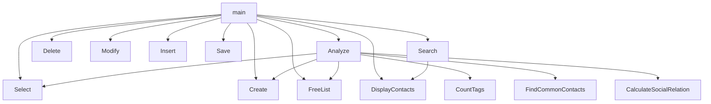

# ContactManagementSystem - 函数调用关系图 (Mermaid)

```mermaid
graph TD
    main --> Select
    main --> Create
    main --> FreeList
    main --> DisplayContacts
    main --> Search
    main --> Delete
    main --> Modify
    main --> Insert
    main --> Save
    main --> Analyze

    Search --> DisplayContacts

    Analyze --> Select
    Analyze --> Create
    Analyze --> CountTags
    Analyze --> FindCommonContacts
    Analyze --> CalculateSocialRelation
    Analyze --> FreeList

    %% 说明：仅显示了文件内函数之间的调用关系，未包含标准库或系统调用。
```
